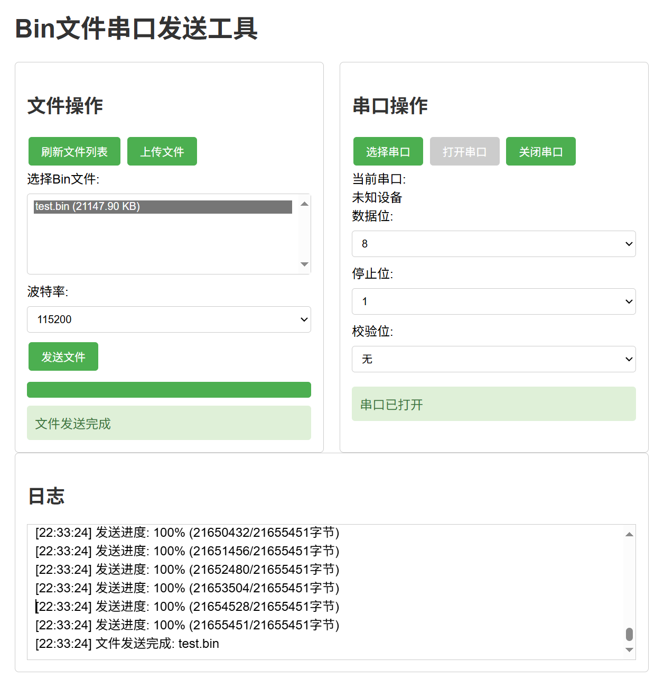
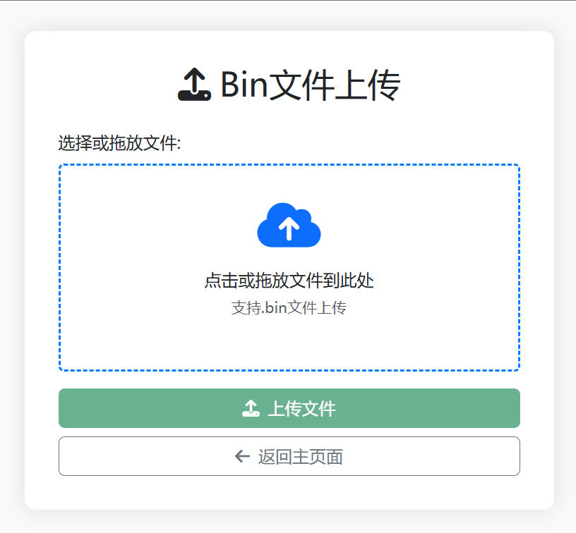

# Bin文件传输工具


一个实现Bin文件云端上传和通过串口下载到设备的Web工具，使用Node.js + Express + Web Serial API构建。

##  功能特性

- **文件管理**
  - 浏览服务器上的bin文件列表
  - 文件大小和修改时间显示
  - 密码保护的bin文件上传界面

- **串口下载**
  - 支持自定义波特率(9600-921600)
  - 可配置数据位、停止位和校验位
  - 实时下载进度显示

- **安全控制**
  - 上传页面密码保护
  - 文件类型限制(.bin only)

##  技术栈

- **后端**
  - Node.js + Express
  - Multer (文件上传处理)
  - CORS 跨域支持

- **前端**
  - Web Serial API (串口通信)
  - Bootstrap 5 (UI框架)
  - Font Awesome (图标)

- **部署**
  - Docker容器化
  - Docker Compose编排

##  快速开始

### 前提条件
- Node.js 16+
- Docker (可选)
- 现代浏览器(Chrome/Edge 89+)

### 安装依赖

```bash
# 必需的核心依赖
npm install express cors body-parser

# 文件上传需要的依赖
npm install multer
```

### 安装运行

#### 方法一：使用Docker(推荐)
```bash
docker-compose up -d
```

#### 方法二：直接运行
```bash
npm install
node server.js
```

### 访问应用
- 主界面: `http://localhost:3000`
- 上传界面: `http://localhost:3000/upload/upload.html` (密码:admin123)

##  使用指南

1. **文件上传**
   - 访问上传页面
   - 输入密码(默认:admin123)
   - 拖放或选择.bin文件
   - 点击上传按钮

2. **串口下载**
   - 在主页面选择文件
   - 点击"选择串口"按钮
   - 配置串口参数
   - 点击"打开串口"
   - 点击"发送文件"

##  项目结构

```
bin-file-server/
├── bins/                  # Bin文件存储
├── public/                # 静态文件
│   ├── upload/            # 上传功能
│   ├── css/               # 样式表
│   └── js/                # 前端逻辑
├── server.js              # 主服务器
├── Dockerfile             # Docker配置
└── docker-compose.yml     # 容器编排
```
## 运行截图
 
 
## ? 开源协议

MIT License

## ? 联系与支持

- 作者: MYxiaoyi
- 博客: [f123.club](https://f123.club)
- 问题反馈: GitHub Issues

> 感谢使用本项目！如有任何问题或建议，欢迎联系。